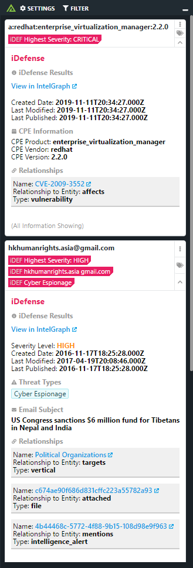

# Polarity iDefense Integration
The Polarity - iDefense integration searches iDefense for associated threat intelligence related to indicators on your screen.

To learn more about iDefense, please visit the [official website](https://www.accenture.com/us-en/service-idefense-security-intelligence).

## iDefense Integration Options

### iDefense ApiKey
ApiKey needed for iDefense.

### Minimum Severity Score
Minimum severity score to display in the Polarity overlay window

### Number of results
Number of iDefense results to return about an associated indicator

### Ignore List
List of domains or Ips that you never want to send to iDefense.

### Ignore Domain Regex
Domains that match the given regex will not be looked up.

### Ignore IP Regex
IPs that match the given regex will not be looked up.

## Polarity

Polarity is a memory-augmentation platform that improves and accelerates analyst decision making.  For more information about the Polarity platform please see:

https://polarity.io/
